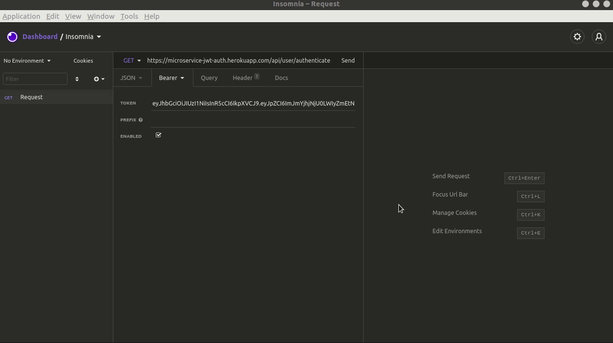

# Microservice-JWT-Auth
My first motivation to build this Microservice was to help the Junior Enterprise CITi to automize it's process of development work. For that, I've builded this Node.js application with Expres.js micro-framework to assembly the server, and structured the Core of this Microservice with the *jsonwebtoken* module of Node.
<br>
<br>
This applications works following theses next steps:
<br>
1- Recive some JWT by the Bearer Token request.
<br>
2 - Run the script looking for incompatibilities, like the different secrets used to encrypt the same variable.
<br>
3 - And finilly, returns the data of the JWT.
<br>
<br>
With that, you're abble to construct different ways to work with this response in the frontend. To help you a little bit with theses ways, I created a simple sample to return True if the JWT is valid, or return False wether the JWT is invalid. This sample is in the client folder located in the root of the project.
<br>
<br>
If you have any feedback or improvements for this Microservice, please contact me and let's talk about it! 🙂

## Feature

<h2 align="center"> Response data </h2>
<p align="center">
  
</p>

---

## Getting Started
These instructions will get you a copy of the project up and running on your local machine for development and testing purposes.

### Prerequisites
You will need to have npm or yarn installed on your machine.

### Installing
To run the project for the **first** time you must follow this steps:

1. Clone the GitHub repository
```bash
git clone https://github.com/Giovaniavs/Microservice-JWT-Auth.git
```

2. Install the dependencies and run the project
```bash
yarn install && yarn start
```

---

## The Developer
* **Giovani Albuquerque** - *Developer* - [Giovaniavs](https://github.com/Giovaniavs)

<p align="right">
  Made by <b> The Giovani Albuquerque </b>
</p>
